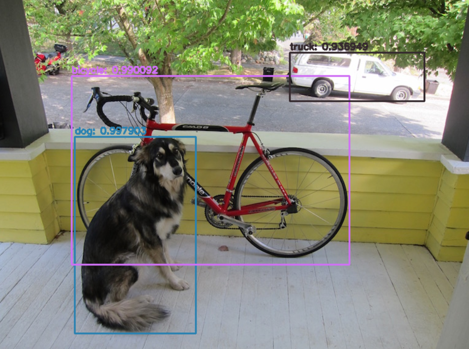
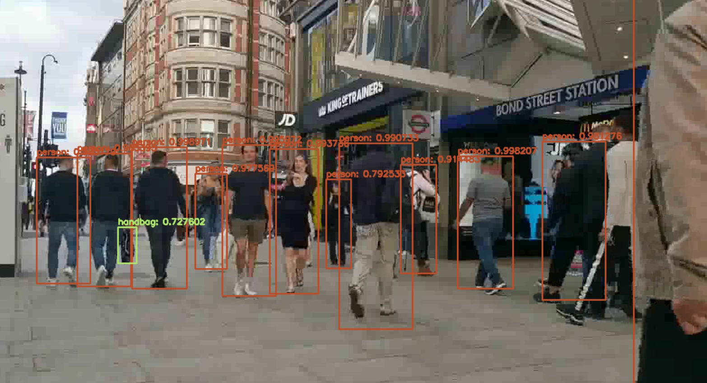

---

# YOLOv3 Object Detection with OpenCV

Welcome to the **YOLOv3 Object Detection with OpenCV** project! 🎯 This project leverages the YOLOv3 model to perform **image, video**, and **real-time webcam object detection** using OpenCV. The pre-trained YOLOv3 models are sourced from the official YOLO paper (2018) and are implemented using Darknet.

Whether you're working with still images, video files, or performing real-time detection with a webcam, this project has got you covered!

---

## 🔥 Features

* **Image Object Detection**: Detect objects in any image file.
* **Video Object Detection**: Perform object detection on videos stored locally.
* **Real-Time Webcam Detection**: Classify and detect objects in real-time using your webcam.
* **Pretrained YOLOv3 Models**: Use the official YOLOv3 models trained on the COCO dataset.
* **Darknet Implementation**: Based on the Darknet framework for YOLOv3.

---

## 🛠️ Prerequisites

Before using the project, ensure you have the following installed on your system:

* **Python 3.x**: The script is compatible with Python 3.
* **OpenCV**: For handling images, video, and webcam input.
* **NumPy**: For handling data arrays.
* **Darknet YOLOv3 model weights & config**: The pre-trained YOLOv3 weights and config file.

---

## 🚀 Getting Started

### 1. Clone the Repository

Start by cloning this repository to your local machine:

```bash
git clone https://github.com/pranayguptag/ML_Models.git
```

### 2. Navigate to the Project Directory

```bash
cd YOLOv3-Object-Detection-with-OpenCV
```

---

## 🖼️ Object Detection on Images

To perform object detection on an image stored on your local machine, run the following command:

```bash
python3 yolo.py --image-path='/path/to/image/'
```

Replace `'/path/to/image/'` with the actual path to the image file you want to process.

---

## 🎥 Object Detection on Videos

To perform object detection on a video file stored on your local machine:

```bash
python3 yolo.py --video-path='/path/to/video/'
```

Make sure to replace `'/path/to/video/'` with the correct path to your video file.

---

## 📹 Real-Time Object Detection with Webcam

To run object detection in real-time using your webcam, simply run the script without any file paths:

```bash
python3 yolo.py
```

---

## ⚙️ Customizing Paths for YOLOv3 Files

The script assumes that the YOLOv3 model weights and config files are located in the `yolov3-coco/` directory. If the files are stored elsewhere, you can provide the path to these files like so:

```bash
python3 yolo.py --weights='/path/to/yolov3.weights' --config='/path/to/yolov3.cfg' --labels='/path/to/coco.names'
```

---

## 🎯 Example Commands

Here are some example commands to get you started:

### Inference on Image:

```bash
python3 yolo.py --image-path='/home/user/images/cat.jpg'
```

### Inference on Video:

```bash
python3 yolo.py --video-path='/home/user/videos/sample.mp4'
```

### Real-Time Webcam Inference:

```bash
python3 yolo.py
```

---

## 🧑‍💻 Additional Information

For more details, options, and customizations, run:

```bash
python3 yolo.py --help
```

This will display a list of all available arguments and settings you can modify.

---

## 📝 Screenshots

### Image Inference



### Video Inference



### Real-Time Webcam Inference


---

## 📚 References

* **[PyImageSearch: YOLOv3 Object Detection with OpenCV](https://www.pyimagesearch.com/2018/11/12/yolo-object-detection-with-opencv/)**: The guide that inspired the implementation of YOLOv3 with OpenCV.
* **[Official YOLOv3 Paper](https://arxiv.org/pdf/1804.02767.pdf)**: The paper that introduced the YOLOv3 model.
* **[Darknet](https://pjreddie.com/darknet/yolo/)**: The framework used for training and running YOLOv3-320 models.

---

## 🛡️ License

This project is distributed under the **MIT License**.

---

## 📬 Contact

If you have any questions or suggestions, feel free to reach out:

* **Author**: [Pranayguptag](https://github.com/pranayguptag)
* **Email**: [pranay992078@gmail.com](mailto:pranay992078@gmail.com)

---

## 💖 Contributions

Contributions are always welcome! Feel free to fork the repository and submit a pull request if you have suggestions or improvements.

---

### Badges

Add these badges to give more details about the project (e.g., build status, license, etc.).


---
